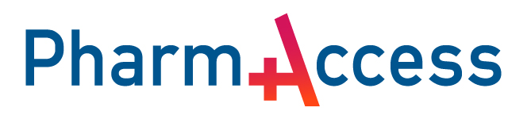

# PharmAccess Foundation GitHub

PharmAccess is dedicated to improving healthcare in low- and middle-income countries through smart digital innovations, value-based care models, and public-private partnerships.

This github -[github.com/pharmaccess](https://github.com/pharmaccess)- is the central repository for all code development at [PharmAccess Foundation](https://www.pharmaccess.org/). It contains both public repositories for demonstrator projects for which the code has been open sourced, as well as private repositories for internal use.

## Digital Health Innovation
Our GitHub organization hosts the open-source components that power our mission to make inclusive digital health systems a reality.

In this GitHub organization, you will find:

- 🧱 **The Connected Care Stack**  
  A modular, standards-based architecture designed to enable patient-centered digital care journeys—starting with maternal health.

- 🔄 **Interoperability & Data Infrastructure**  
  Repositories that support HL7 FHIR, OpenHIE, FAIR and other data sharing frameworks beyond The Connected Care Stack.

- 🛠️ **Supporting Libraries and Tools**  
  Shared libraries, utilities, and reusable components to support development and deployment across various healthcare use cases.

- 🔐 **Private Repositories**  
  Internal codebases for secure and ongoing program operations in implementation countries.

---

### Connected Care: Adopt & Adapt

**The MomCare Connected Care Stack** is a technical implementation for quality improvements in pregnancy care.

With its interoperable digital infrastructure we aim to support quality maternal healthcare delivery across low-resource settings. It connects the full journey of care—spanning enrollment, direct patient engagement, clinical touchpoints, data exchange, and analytics—into a seamless digital ecosystem.

🧱 **The Connected Care Stack** related repositories are listed below and described in the [Connected Care Publication](https://pharmaccess.github.io/momcare-valuepoints-documentation/). 

 - Health Data Exchange Architecture

   *Technical Interoperability:*
    - [Data Pipeline](https://github.com/PharmAccess/data-pipelines/tree/main/pipelines/flows/hdc)
    - [Anonymized data](https://github.com/PharmAccess/hdc-furahi)

   *Syntactic Interoperability:*
    - [FHIR profile](https://github.com/PharmAccess/MamaToTo-FHIR-IG)
    - [Generic Mapping Tool](https://github.com/PharmAccess/FHIRPathMappingLanguage)
      
 - Journey-Based Analytics Dashboard
    - [Metrics](https://github.com/PharmAccess/open-mnch-dbt-analytics)
    - [Shiny App](https://github.com/PharmAccess/hdc-inspire-clinics-kisumu-app)
  - Digital Enrolment via WhatsApp
    - [FHIR questionnaire](https://github.com/PharmAccess/mamatoto/tree/main)
  
We welcome collaboration! Please review our [Connected Care Publication](https://pharmaccess.github.io/momcare-valuepoints-documentation/) to learn how you can contribute to our open-source projects, whether through code, documentation, or implementation feedback.

---

PharmAccess Foundation · Enabling digital health for inclusive, high-quality care.
